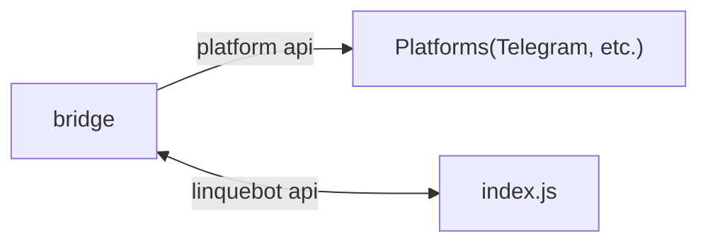

项目框架规划：

依赖nodejs运行

## config.example.yml

全局配置文件的示例

## config.yml

全局配置文件（真正起作用，被git ignore）

## index.js

主程序入口

## bridges/

桥，负责用各自的api沟通群聊平台，转译为linquebot的api

## data/

存放数据。每个群以id单独建一个文件夹。

## lib/

存放index.js要用到的

**以telegram.js为基准**

计划每个linequebot实例只响应一个平台，bridges只作为未来的多平台兼容。如需多平台需要clone多个linquebot实例。

## plugins/

每个plugin单独为一个文件夹，响应插件定义的命令对应的动作。

每个plugin有一个index.js作为入口，export一个init()
